<!--
author:   David Croft

email:    david.croft@warwick.ac.uk

version:  0.0.1

language: en

narrator: US English Female

comment:  Short activity based for identifying the extrinsic parameters of a camera pair.
          Although we are using the stereo camera calibrator app for this activity, the 
          principles are the same for any multi camera calibration with a shared field of view.

classroom: false
icon: ../assets/logo.svg
logo: images/garage.png
-->

# Stereo Calibrator Activity

Short activity based for identifying the extrinsic parameters of a camera pair.

Although we are using the stereo camera calibrator app for this activity, 
the principles are the same for any multi camera calibration with a shared field of view.

In this scenario we have a pair of cameras mounted on a vehicle in an indoor environment.
This is a limited amount of visual and physical clutter in the scene.

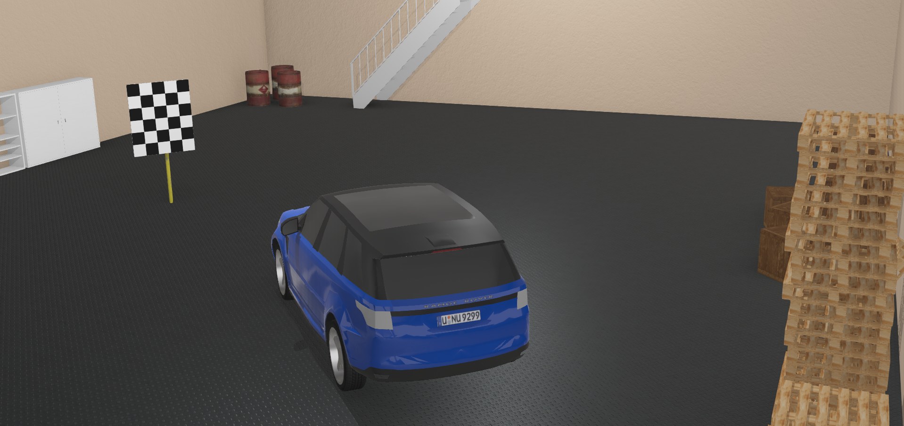

## Opening Matlab

Depending on the provision you will either be using MATLAB installed on the provided laptops or MATLAB Online.

Both tools function near identically once open but running the software is different.

{{1}}
> **Select the appropriate option below.**

**Installed MATLAB**

{{2}}
> **Download the calibration images from [here](dataset.zip).**
>
> - Unzip (extract) the contents to a location you can easily find, you will need them later.

{{3}} 
> **Using the provided laptop open MATLAB.**
>
> This activity has been tested on MATLAB R2022b through R2024a.
>
> <!-- style="width: 24px;" --> Windows users can search for MATLAB in the start menu.
> 
> 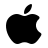<!-- style="width: 24px;" --> Mac users will find it in the applications folder.
> 
> <!-- style="width: 24px;" --> Linux users, this will depend on your distro. 
> But standard locations are `/usr/local/MATLAB/R20xxx/bin/matlab` or `/usr/local/bin/matlab`.

{{4}}
> When finished you should have a screen that looks like the one below.
>
> 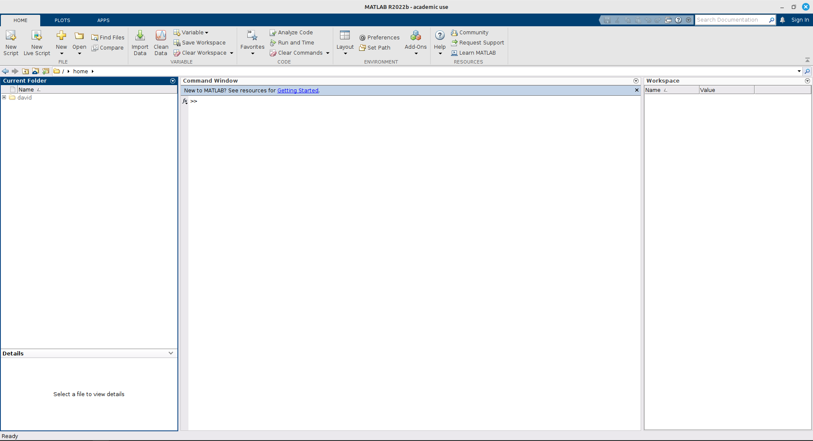

**MATLAB Online**

{{2}}
> **Go to [https://matlab.mathworks.com](https://matlab.mathworks.com).**

{{3}}
> **Sign in with your MathWorks account.**
>
> - Or using the provided account details.

{{4}}
> **Click `Open MATLAB Online`.**
>
> 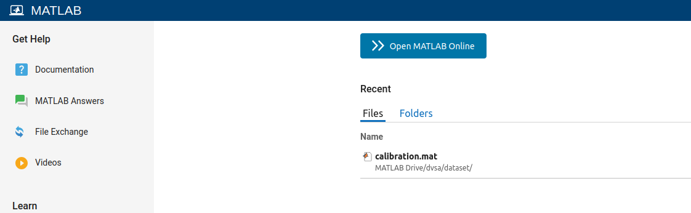

{{5}}
> **Wait for MATLAB to load.**

{{6}}
> When finished you should have a screen that looks like the one below.
>
> 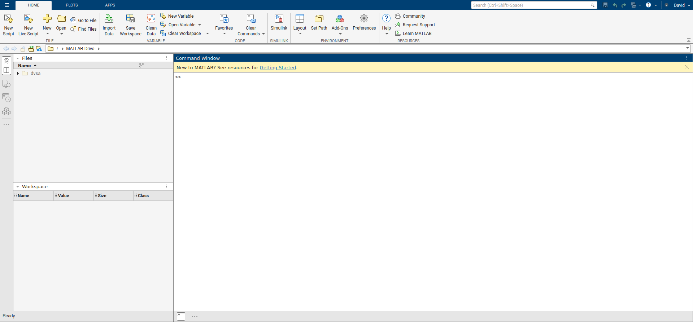

## Opening calibrator app

You should be looking at the default MATLAB workspace screen.

{{1}}
> **Select `APPS` tab at the top of the window.**
>
> 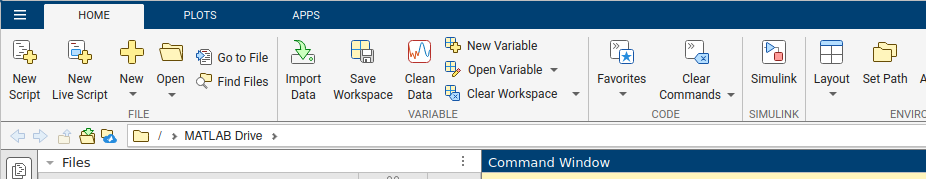

{{2}}
> A series of app icons should appear top of screen.
>
> 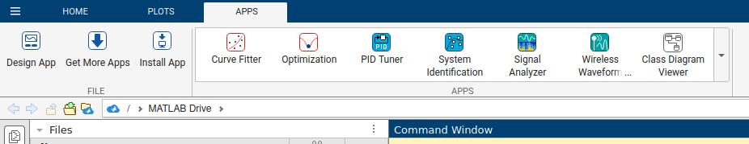

{{3}}
> **In `APPS` selector click the ▾ button and search for "Stereo Camera Calibrator".**
>
> 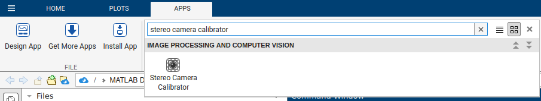

{{4}}
> **Click on the app icon to open the app.**
> 
> - You may be asked to allow matlab.mathworks.com to use your camera. It doesn't matter what you choose, we will not be using the webcam for this activity.

## Loading the images

You should be looking at the MATLAB Stereo Camera Calibrator screen.

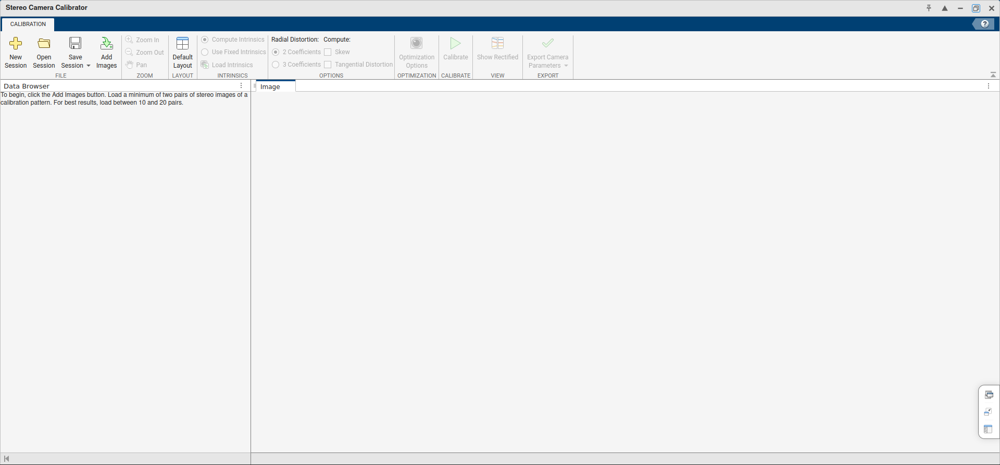

{{1}}
> **Click `New Session`.**
>
> 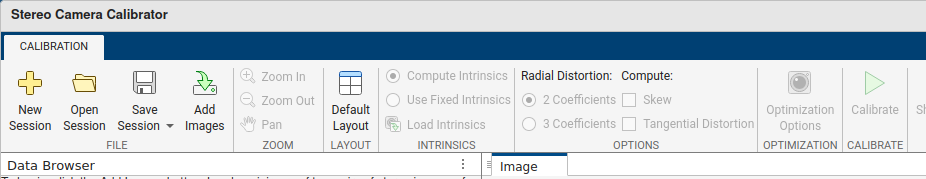

{{2}}
> **Click `Add Images`.**

{{3}}
> **`Browse` for the `camera 1` images and select the `image_l` directory.**
> 
> - If you are using install MATLAB this will be where ever you unzipped the files earlier.
> - If you are using MATLAB in your browser, this will be the `dvsa` -> `dataset` -> `image_l` directory already provided.
>
> 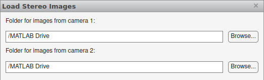

{{4}}
> `Browse` for the `camera 2` images and select the `image_r` directory.
> 
> - If you are using install MATLAB this will be where ever you unzipped the images earlier.
> - If you are using MATLAB in your browser, this will be the `dvsa` -> `dataset` -> `image_r` directory already provided.

{{5}}
> Change the `Properties` of the checkerboard. 
>
> - `Size of the checkerboard square` should be 100mm (or 10cm).
>
> 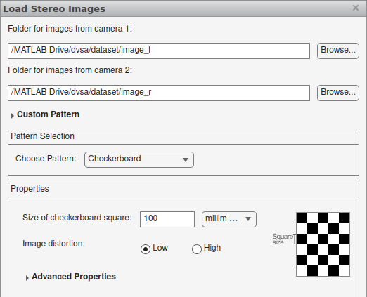

{{6}}
> Click `OK`.

{{7}}
> Wait.
> 
> - If you have done the previous steps you should see the following pop ups appear.
> 
>   1. `Analysing images`.
>
>   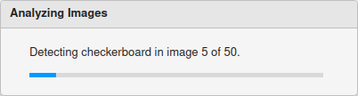
> 
>   2. `Detection Results`.
> 
>     - Leave this window open.
>
>   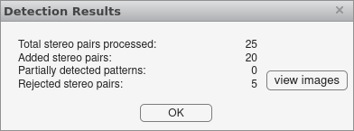

## Detection Results

You should be looking at the `Detection Results` window.

- This window should should have details of the `Total stereo pairs processed` and `Rejected stereo pairs`.

{{1}}
> **Click `view images` to see the rejected images.**
>
> 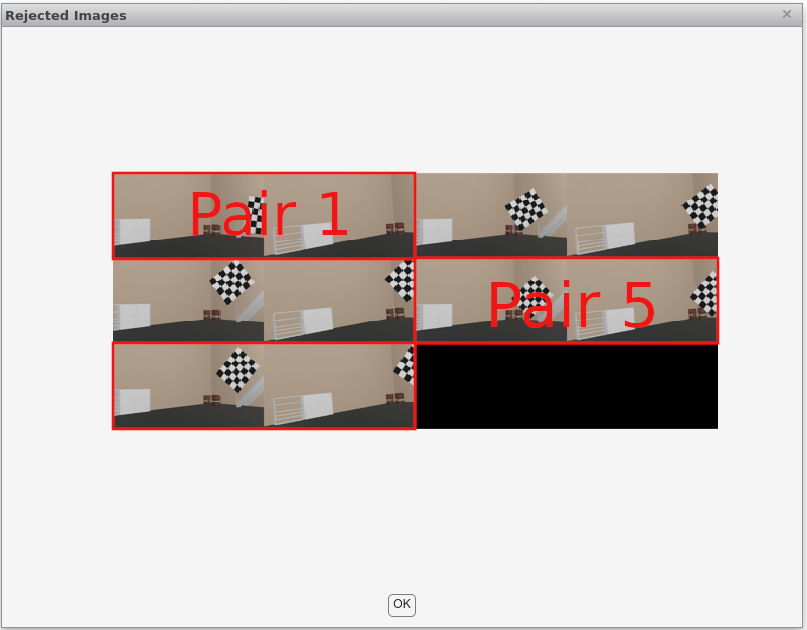

**What do you notice about the rejected images?**

- Why did MATLAB not include them in the calibration process?

**Hint 1**

*The rejected images all have the same issue*.

**Hint 2**

*The rejected pairs have the calibration target missing from one of the pair.*

*At least part of the target is missing.*

*In some cases the entire target is absent.*

  

{{2}}
> **Click `OK` to close the `Rejected Images` window.**

{{3}}
> **Click `OK` to close the `Detection Results` window.**

## Calibration

You should now be on the calibration screen with the images loaded.

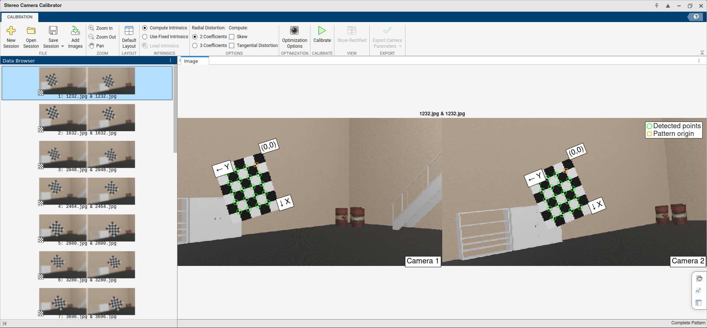

**See that the images for the stereo pairs are different.**

- This is because the cameras are in different positions.

**See that the checkerboard pattern has been detected in each image.**

- Corner points of the inner checkerboard squares are marked with circles.
- Checkerboard pattern is a known size, so the distance between the circles is known.
  - Apparent distance between the circles (in pixels) *something something distance*
- Checkerboard pattern is a rectangle, not a square.
  - To avoid possible confusion regarding the orientation of the target. 

{{1}}
> **Click `Calibrate`.**
>
> 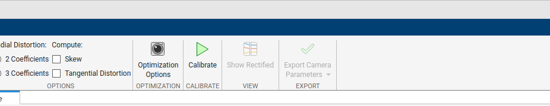

{{2}}
> Wait.
> 
> - If you have done the previous steps you should see the following pop ups appear.
>
>   - `Calibration Progress`

## Results

{{1}}
> Double click on `stereoParams` in the workspace to see the results.

{{2}}
> Double click on `PoseCamera2`.
> 
> - This is the relative position of camera 2 with respect to camera 1.

`PoseCamera2` is a structure containing multiple pieces of information.

- `Translation` is the $[X, Y, Z]$ positions.
  - In millimeters.
- `R` is the 3x3 rotation matrix.
  - In radians.
- `A` is the 4x4 transformation matrix.
  - I.e. the combination of `R` and `Translation`.

$$
 \begin{bmatrix}
   \htmlStyle{color: green}{R_{00}} & \htmlStyle{color: green}{R_{01}} & \htmlStyle{color: green}{R_{02}} & \htmlStyle{color: red}{X} \\
   \htmlStyle{color: green}{R_{10}} & \htmlStyle{color: green}{R_{11}} & \htmlStyle{color: green}{R_{12}} & \htmlStyle{color: red}{Y} \\
   \htmlStyle{color: green}{R_{20}} & \htmlStyle{color: green}{R_{21}} & \htmlStyle{color: green}{R_{22}} & \htmlStyle{color: red}{Z} \\
   \htmlStyle{color: lightgrey}{0.0} & \htmlStyle{color: lightgrey}{0.0} & \htmlStyle{color: lightgrey}{0.0} & \htmlStyle{color: lightgrey}{1.0}
 \end{bmatrix}
$$

{{3}}
> Look at  `A`.
>
> - Which should look something like this:
> 
> $$
 \begin{bmatrix}
   0.9937680 & -0.0869434 &  0.0697565 & 10.123456 \\
   0.0906732 &  0.9945112 & -0.0522085 & 20.234567 \\
  -0.0648344 &  0.0582081 &  0.9961969 & 30.345678 \\
   0.0       &  0.0       &  0.0       & 1.0
 \end{bmatrix}
$$
>
> The X, Y, Z values should be immediately understandable, just be aware that they are in millimeters.

{{4}}
> The orientation information is less comprehensible but we can use matlab to convert these results to a more human friendly format by entering the following command in to the matlab command window.
> 
> - `rad2deg( rotm2eul( stereoParams.PoseCamera2.R, "XYZ" ) )`
> 
> This is going to take the rotation matrix `R` and convert it to Euler angles (roll, pitch, yaw). 
>
> Then we convert the angles from radians to degrees.
> 
> - There are also [online converters](https://www.andre-gaschler.com/rotationconverter/) available. 

## Answers

The image pairs were taken from pair of cameras mounted on a simulated Range Rover.

For this scenario the cameras were deliberately miss-aligned in order to create a issue for sensor fusion.

Because this is a simulated environment rather than reality we can easily extract actual positions and orientations of the cameras to compare against the results of the calibration.

It is extremely unlikely that the calibration values that you have obtained will match these exactly.

- Especially with the limited number of images used.
- There are additional steps that could be taken to improve the calibration.

  - But they add time and complexity.

The important thing is that the values are within the right ballpark.

- If the values are wildly different then could be an issue with the calibration process.
- Or it could indicate that the cameras are not correctly aligned.

**Click for correct values.**

> The right hand camera is positioned exactly 0.2m (or 200mm) to the side of the left hand camera.
> 
> With a relative orientation of:
> 
> - Roll: 1.31°
> - Pitch: -9.89°
> - Yaw: 10.11°

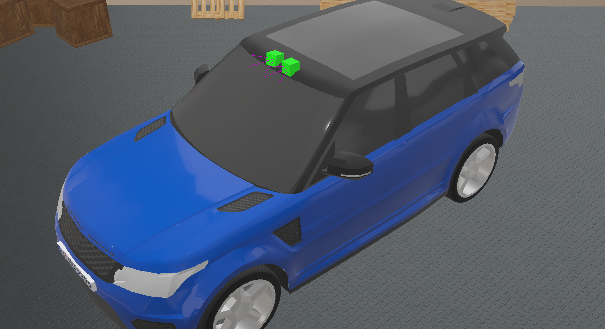 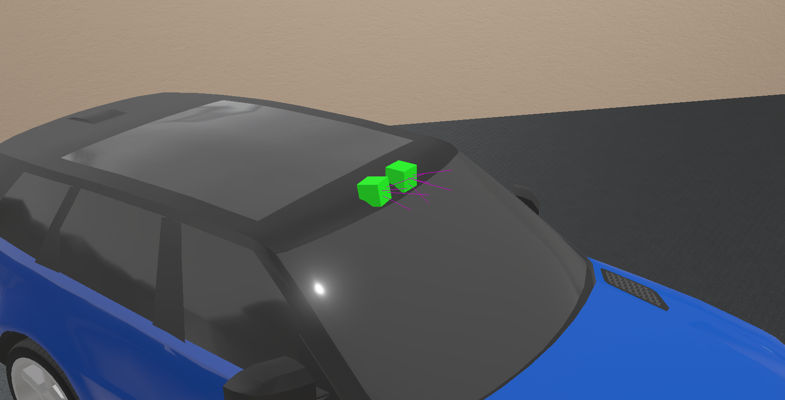 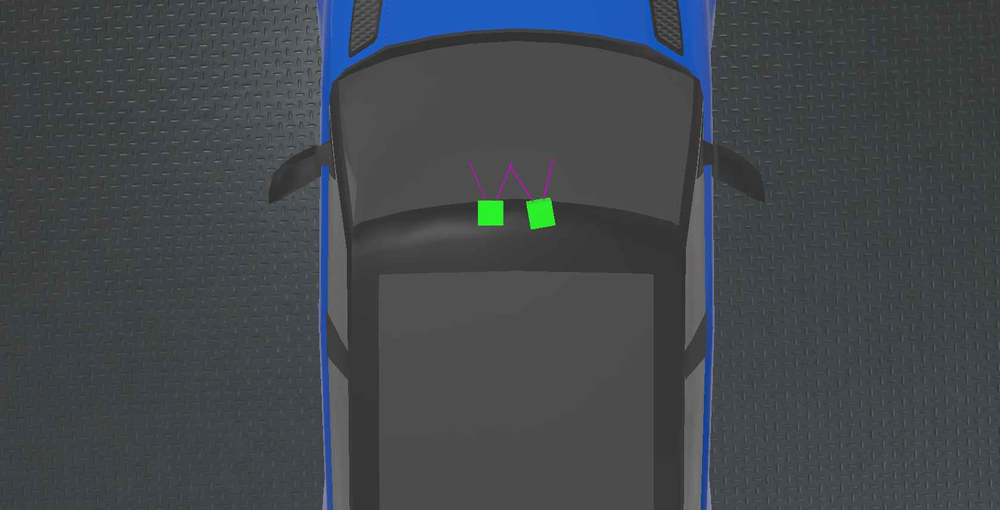

## End of Activity

Well done, with any luck you know have a better understanding of how to calibrate a pair of cameras.

Other sensors calibrations depend on the same principles but the specifics will vary according to the sensor type.

Calibrating lidar for example relies on identifying the physical shape of the calibration target in the point cloud data as opposed to the pattern on the target.
