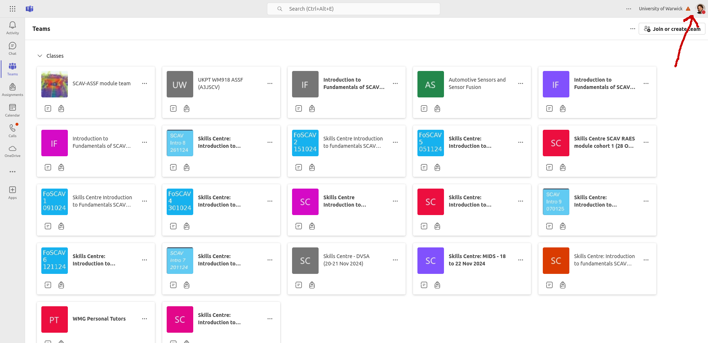
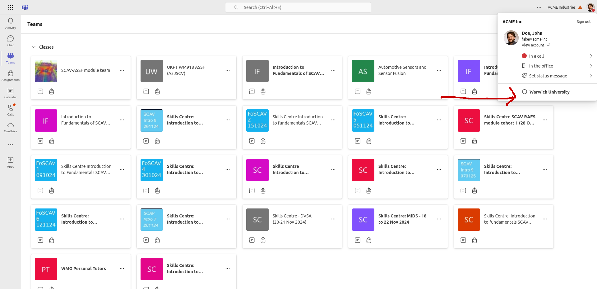

<!--
author:   David Croft

email:    david.croft@warwick.ac.uk

version:  0.0.1

language: en

narrator: US English Female

comment:  

classroom: false
icon: https://dscroft.github.io/liascript_materials/assets/logo.svg

-->

# Teams

## Changing to Warwick Organisation

These instructions are for using Teams in your web browser.

If you are using the desktop app the steps are very similar.

{{1}}
> Open Teams in your web browser.
>
> - Go to [teams.microsoft.com](https://teams.microsoft.com).

{{2}}
> Log in to your account.

{{3}}
> Click on your profile picture in the top right corner.
>
> - This will open a drop-down menu.
>
> 

{{4}}
> Select "University of Warwick" as your organisation.
>
> 

{{5}}
> Done!